# Load Balancer

A **Load Balancer** is a component that distributes incoming network traffic across multiple backend servers.

Instead of sending every request to a single server, the Load Balancer decides **which backend server should handle each connection or request**.

This helps applications achieve:

- High availability
- Scalability
- Better performance
- Fault tolerance
- Automatic failover
- Zero/minimal downtime during deployments
- Efficient resource utilization

---

# Table of Contents

- [1. What is a Load Balancer?](#1-what-is-a-load-balancer)
- [2. Why Do We Need a Load Balancer?](#2-why-do-we-need-a-load-balancer)
- [3. Real-World Analogy](#3-real-world-analogy)
- [4. Basic Load Balancer Architecture](#4-basic-load-balancer-architecture)
- [5. OSI Model Basics](#5-osi-model-basics)
- [6. Layer 4 Load Balancer](#6-layer-4-load-balancer)
- [7. How L4 Load Balancing Works](#7-how-l4-load-balancing-works)
- [8. L4 Load Balancing Algorithms](#8-l4-load-balancing-algorithms)
- [9. L4 Health Checks](#9-l4-health-checks)
- [10. L4 Advantages and Disadvantages](#10-l4-advantages-and-disadvantages)
- [11. L4 Real-World Examples](#11-l4-real-world-examples)
- [12. Layer 7 Load Balancer](#12-layer-7-load-balancer)
- [13. How L7 Load Balancing Works](#13-how-l7-load-balancing-works)
- [14. L7 Path-Based Routing](#14-l7-path-based-routing)
- [15. L7 Host-Based Routing](#15-l7-host-based-routing)
- [16. L7 Header-Based Routing](#16-l7-header-based-routing)
- [17. L7 Cookie-Based Routing](#17-l7-cookie-based-routing)
- [18. TLS/SSL Termination](#18-tlsssl-termination)
- [19. L7 Health Checks](#19-l7-health-checks)
- [20. L7 Advantages and Disadvantages](#20-l7-advantages-and-disadvantages)
- [21. L4 vs L7](#21-l4-vs-l7)
- [22. Load Balancing Algorithms](#22-load-balancing-algorithms)
- [23. Failover](#23-failover)
- [24. Connection Draining](#24-connection-draining)
- [25. Session Persistence](#25-session-persistence)
- [26. Reverse Proxy vs Load Balancer](#26-reverse-proxy-vs-load-balancer)
- [27. Forward Proxy vs Reverse Proxy](#27-forward-proxy-vs-reverse-proxy)
- [28. L4 + L7 Architecture](#28-l4--l7-architecture)
- [29. Production Architecture](#29-production-architecture)
- [30. Kubernetes Load Balancing](#30-kubernetes-load-balancing)
- [31. NGINX L7 Example](#31-nginx-l7-example)
- [32. L4 TCP Example](#32-l4-tcp-example)
- [33. Common Failure Scenarios](#33-common-failure-scenarios)
- [34. Monitoring](#34-monitoring)
- [35. Security](#35-security)
- [36. Troubleshooting](#36-troubleshooting)
- [37. Common Misconceptions](#37-common-misconceptions)
- [38. Interview Questions](#38-interview-questions)
- [39. Quick Cheat Sheet](#39-quick-cheat-sheet)

---

# 1. What is a Load Balancer?

Imagine we have one application server:

```text
                    Users
                      |
                      v
               +-------------+
               |   Server    |
               |    :443     |
               +-------------+
```

Initially this might work perfectly.

But as the number of users increases:

```text
                 100,000 Users
                       |
                       v
                +-------------+
                |   Server    |
                |    :443     |
                +-------------+
                       |
                       X
                 Server overloaded
```

The server can eventually become:

- CPU constrained
- Memory constrained
- Network constrained
- Connection constrained
- Application constrained

Instead of using one server, we can use multiple servers:

```text
                     Users
                       |
                       v
          +-------------------------+
          |       Load Balancer     |
          +-------------------------+
             /          |          \
            /           |           \
           v            v            v
      +---------+  +---------+  +---------+
      | Server1 |  | Server2 |  | Server3 |
      +---------+  +---------+  +---------+
```

The Load Balancer distributes traffic between the servers.

---

# 2. Why Do We Need a Load Balancer?

A Load Balancer solves several important problems.

## 2.1 High Availability

If one server fails, traffic can be sent to another healthy server.

```text
                 Load Balancer
                       |
             +---------+---------+
             |         |         |
             v         v         v
          Server1   Server2   Server3
             ✓         ✗         ✓
                       |
                    FAILED
```

The Load Balancer stops sending new traffic to Server2.

---

## 2.2 Scalability

Suppose one server can handle 1,000 requests/second.

Instead of continuously making one server bigger:

```text
1 Server
    |
    v
More CPU
More RAM
More expensive machine
```

we can add more servers:

```text
              Load Balancer
                    |
        +-----------+-----------+
        |           |           |
        v           v           v
      Server1     Server2     Server3
       1K RPS      1K RPS      1K RPS

             ~3K RPS capacity
```

This is called **horizontal scaling**.

---

## 2.3 Fault Tolerance

If one server crashes:

```text
             Load Balancer
                   |
          +--------+--------+
          |        |        |
          v        v        v
        App1     App2     App3
         ✓         ✗        ✓
```

The application can continue serving users through App1 and App3.

---

## 2.4 Zero/Minimal Downtime Deployments

Suppose we want to deploy a new version.

We can temporarily remove a server from the Load Balancer:

```text
              Load Balancer
                   |
           New traffic only
                   |
          +--------+--------+
          |                 |
          v                 v
       Server1           Server2
         ✓                  ✓

                  Server3
                     |
                     v
                  Updating
```

After deployment:

```text
Server3
   |
   v
Health check passes
   |
   v
Added back to pool
```

---

# 3. Real-World Analogy

Imagine a restaurant.

There are three service counters:

```text
                    Customers
                        |
                        v
                 +-------------+
                 | Host/Staff  |
                 +-------------+
                  /     |     \
                 /      |      \
                v       v       v
            Counter1 Counter2 Counter3
```

The staff member decides:

> "Counter 1 is busy. Send the next customer to Counter 2."

A Load Balancer does something similar for network traffic.

The important difference is that a Load Balancer makes these decisions using **network and application information**.

---

# 4. Basic Load Balancer Architecture

A basic architecture looks like this:

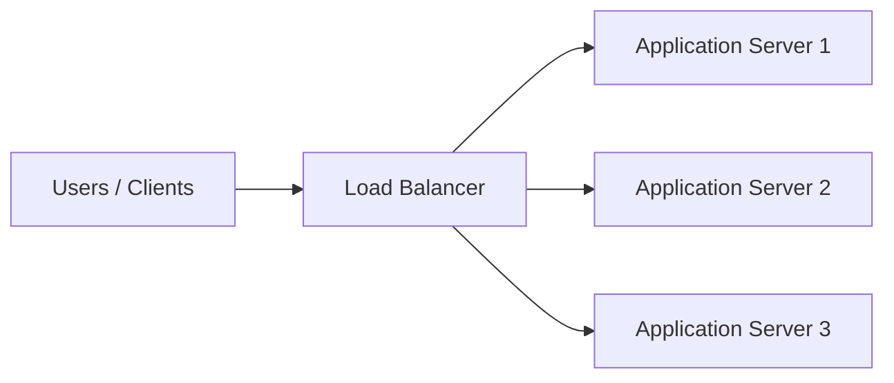

A more realistic architecture:

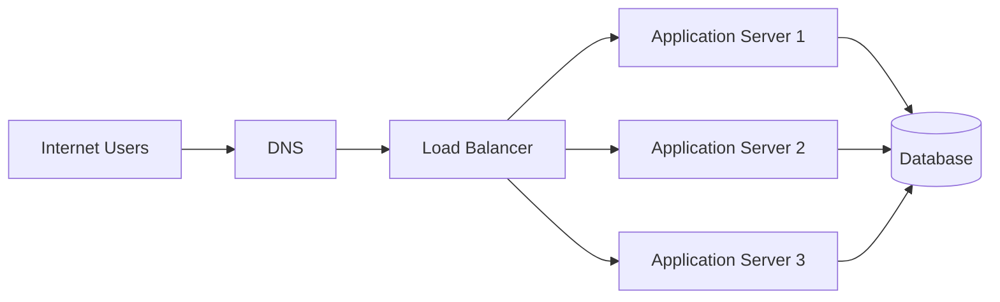

---

# 5. OSI Model Basics

To understand L4 and L7 Load Balancers, we need to understand the OSI model.

```text
+--------------------------------+
| Layer 7 - Application          | HTTP / HTTPS
+--------------------------------+
| Layer 6 - Presentation         |
+--------------------------------+
| Layer 5 - Session              |
+--------------------------------+
| Layer 4 - Transport            | TCP / UDP
+--------------------------------+
| Layer 3 - Network              | IP
+--------------------------------+
| Layer 2 - Data Link            |
+--------------------------------+
| Layer 1 - Physical             |
+--------------------------------+
```

For Load Balancing, the most important layers are:

```text
Layer 3
   |
   +-- IP

Layer 4
   |
   +-- TCP
   +-- UDP
   +-- Ports

Layer 7
   |
   +-- HTTP
   +-- HTTPS
   +-- Headers
   +-- Cookies
   +-- URL
```

The key distinction is:

> **L4 understands network connections.**

> **L7 understands application requests.**

---

# 6. Layer 4 Load Balancer

A **Layer 4 Load Balancer** works at the Transport Layer.

It primarily makes decisions using information such as:

- Source IP
- Destination IP
- Source port
- Destination port
- TCP
- UDP
- Connection state

It does not need to understand the contents of an HTTP request.

## Simple L4 Architecture

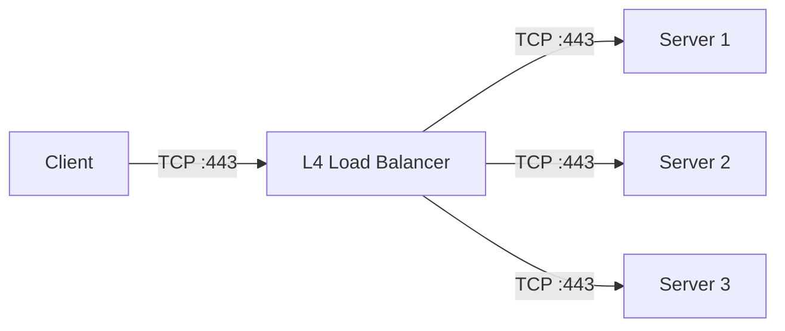

Suppose a client connects to:

```text
10.0.0.100:443
```

The Load Balancer might forward that connection to:

```text
10.0.1.10:443
```

or:

```text
10.0.1.11:443
```

or:

```text
10.0.1.12:443
```

---

# 7. How L4 Load Balancing Works

Let's understand this step-by-step.

The client is:

```text
192.168.1.10
```

The Load Balancer has a virtual IP:

```text
10.0.0.100
```

The client wants to connect to:

```text
10.0.0.100:443
```

The connection looks approximately like:

```text
Source:
192.168.1.10:50000

Destination:
10.0.0.100:443

Protocol:
TCP
```

The L4 Load Balancer sees information like:

```text
Source IP        = 192.168.1.10
Source Port      = 50000

Destination IP   = 10.0.0.100
Destination Port = 443

Protocol         = TCP
```

It then selects a backend:

```text
                    Client
                192.168.1.10
                     |
                     | TCP :443
                     v
             +---------------+
             |    L4 LB      |
             | 10.0.0.100    |
             +---------------+
                     |
              +------+------+
              |             |
              v             v
          Server 1       Server 2
          10.0.1.10     10.0.1.11
             :443          :443
```

The important point:

The L4 Load Balancer doesn't have to understand:

```http
GET /api/users HTTP/1.1
Host: example.com
Authorization: Bearer xyz
```

It can operate primarily on the TCP/UDP connection.

---

# 8. L4 Load Balancing Algorithms

The Load Balancer needs a method for deciding which backend receives traffic.

Common algorithms include:

- Round Robin
- Weighted Round Robin
- Least Connections
- IP Hash
- Random
- Consistent Hashing

---

## 8.1 Round Robin

Requests are distributed sequentially.

```text
Request 1 ---> Server 1
Request 2 ---> Server 2
Request 3 ---> Server 3
Request 4 ---> Server 1
Request 5 ---> Server 2
Request 6 ---> Server 3
```

Round Robin works well when backend servers have approximately equal capacity and requests have similar cost.

---

## 8.2 Weighted Round Robin

Suppose:

```text
Server 1 = powerful
Server 2 = medium
Server 3 = small
```

We can assign:

```text
Server 1 = Weight 5
Server 2 = Weight 3
Server 3 = Weight 1
```

The more powerful server receives more traffic.

```text
                 Load Balancer
                      |
        +-------------+-------------+
        |             |             |
        v             v             v
      Server1       Server2       Server3
      Weight 5      Weight 3      Weight 1
```

---

## 8.3 Least Connections

The Load Balancer sends new connections to the backend with the fewest active connections.

Example:

```text
Server 1 = 100 connections
Server 2 = 20 connections
Server 3 = 50 connections
```

The next connection is likely sent to:

```text
Server 2
```

because it currently has the fewest connections.

---

## 8.4 IP Hash

The client's IP is used to determine the backend.

```text
Client A ---> Server 1
Client B ---> Server 2
Client C ---> Server 3
```

The same client may repeatedly map to the same backend, depending on the hashing implementation and backend membership.

This can be useful when some degree of session persistence is required.

---

# 9. L4 Health Checks

A Load Balancer should not blindly send traffic to every backend.

It needs to know:

> "Is this server actually available?"

For example:

```text
              L4 Load Balancer
                     |
          +----------+----------+
          |          |          |
          v          v          v
       Server1    Server2    Server3
          ✓          ✗          ✓
```

Server2 is unhealthy.

The Load Balancer removes Server2 from the active backend pool:

```text
              L4 Load Balancer
                     |
                +----+----+
                |         |
                v         v
             Server1   Server3
                ✓         ✓
```

A basic TCP health check might attempt to connect to:

```text
10.0.1.10:443
```

If the TCP connection succeeds, the server may be considered reachable.

However:

> A successful TCP connection does not necessarily mean the application itself is healthy.

For application-level health, an HTTP health check can be more meaningful.

---

# 10. L4 Advantages and Disadvantages

## Advantages

- Very fast
- Low processing overhead
- Handles large numbers of connections
- Works with TCP
- Can work with UDP
- Does not need to understand application protocols
- Useful for non-HTTP applications

## Disadvantages

- Cannot easily route based on URL
- Cannot inspect HTTP headers
- Cannot make decisions based on cookies
- Has limited application awareness
- Cannot use application semantics to make routing decisions

---

# 11. L4 Real-World Examples

L4 can be useful for:

- TCP applications
- UDP applications
- Gaming
- DNS traffic
- SMTP
- Database connections
- Custom TCP protocols
- High-throughput network services

Example:

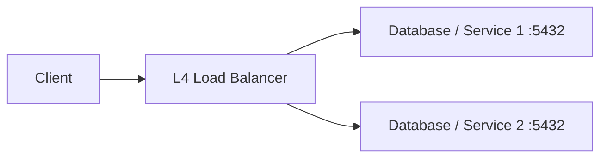

For database traffic, however, load balancing must be designed with awareness of the database's replication, consistency, write/read behavior, and client connection semantics.

---

# 12. Layer 7 Load Balancer

A **Layer 7 Load Balancer** works at the Application Layer.

It understands application protocols such as HTTP/HTTPS.

Therefore, it can inspect information such as:

- HTTP method
- URL
- Path
- Host
- Headers
- Cookies
- Query parameters
- TLS information
- Content type

This allows much smarter routing decisions.

## Basic L7 Architecture

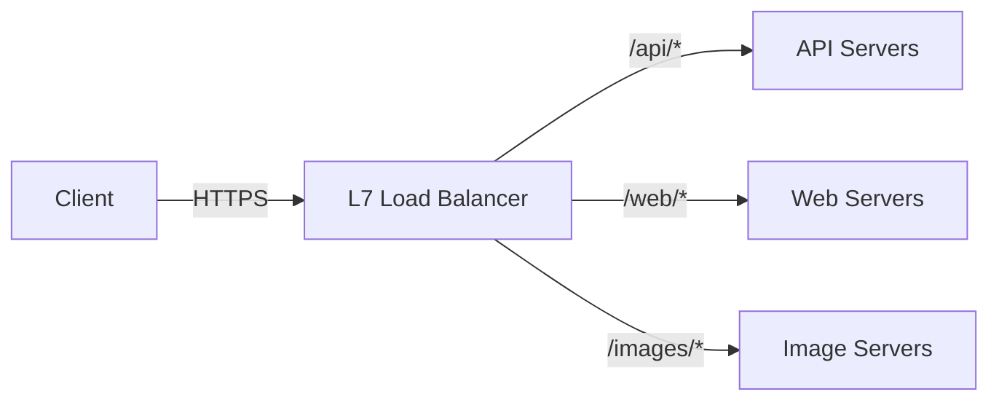

---

# 13. How L7 Load Balancing Works

Suppose the client sends:

```http
GET /api/users HTTP/1.1
Host: example.com
User-Agent: Chrome
```

An L7 Load Balancer can inspect:

```text
HTTP Method = GET

Path = /api/users

Host = example.com

User-Agent = Chrome
```

Then it can make a decision:

```text
/api/users
     |
     v
API backend
```

Another request:

```text
GET /images/logo.png
```

can be routed somewhere else:

```text
/images/logo.png
        |
        v
Image backend
```

This is the biggest conceptual difference between L4 and L7.

---

# 14. L7 Path-Based Routing

Suppose we have:

```text
/api/*
/web/*
/images/*
```

The Load Balancer can route each path to a different backend.

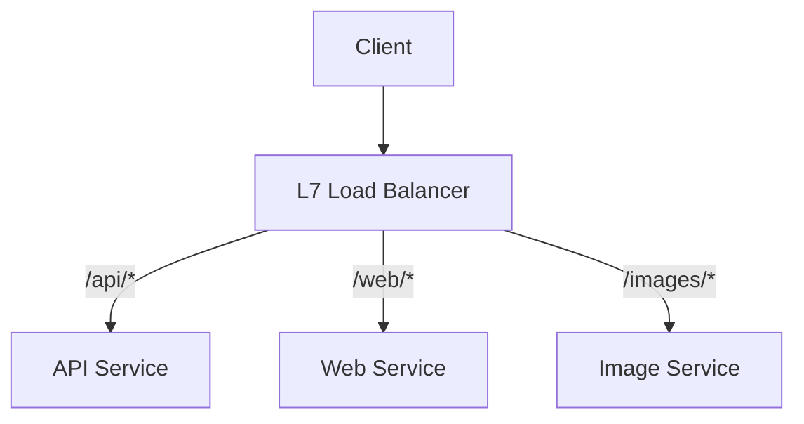

Example:

```text
https://example.com/api/users
            |
            v
        API Servers
```

```text
https://example.com/web/home
            |
            v
        Web Servers
```

```text
https://example.com/images/logo.png
            |
            v
       Image Servers
```

---

# 15. L7 Host-Based Routing

L7 can also route based on the hostname.

Example:

```text
api.example.com
www.example.com
admin.example.com
```

Architecture:

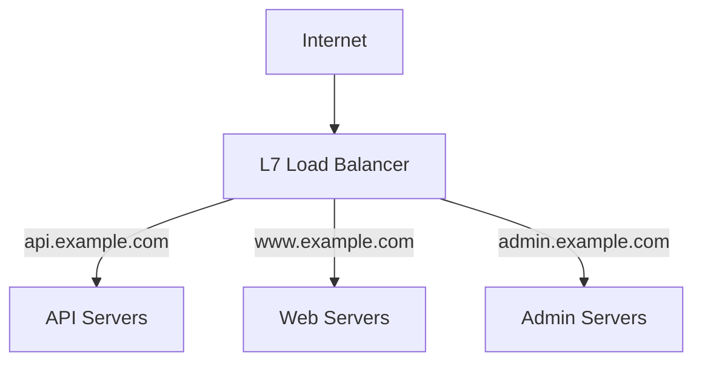

This allows multiple applications to share a Load Balancer.

---

# 16. L7 Header-Based Routing

L7 can inspect HTTP headers.

For example:

```http
X-API-Version: v2
```

The Load Balancer can route:

```text
v1 ---> Version 1 API
v2 ---> Version 2 API
```

Example:

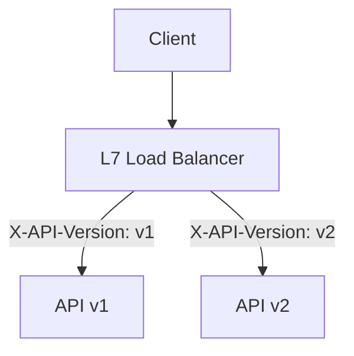

This can be useful for:

- API versioning
- Canary releases
- Feature testing
- Internal traffic routing

---

# 17. L7 Cookie-Based Routing

Cookies can also influence routing.

For example:

```http
Cookie: SESSION_ID=ABC123
```

A Load Balancer may maintain session affinity so that a particular client continues to reach the same backend.

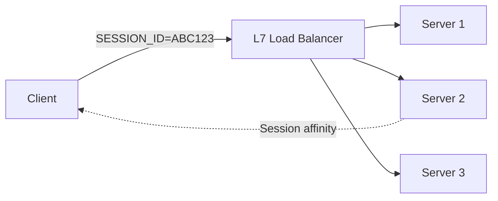

This is commonly called:

- Sticky sessions
- Session affinity
- Cookie-based persistence

Sticky sessions can be useful, but they can also make scaling and failover more complicated.

Stateless applications are generally easier to distribute across many backend instances.

---

# 18. TLS/SSL Termination

One major feature of an L7 Load Balancer is TLS termination.

## TLS Termination at the Load Balancer

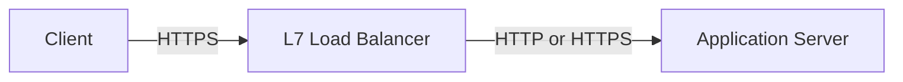

The Load Balancer handles the TLS connection from the client.

For example:

```text
Client
   |
   | HTTPS
   v
Load Balancer
   |
   | HTTP
   v
Application
```

This is called **TLS termination**.

The Load Balancer can then perform tasks such as:

- Certificate management
- TLS negotiation
- HTTP routing
- Header inspection
- Path-based routing

---

## TLS Passthrough

Another design is TLS passthrough:

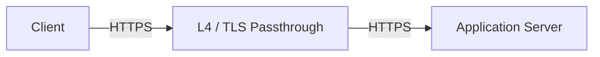

The Load Balancer forwards encrypted traffic without terminating TLS.

The backend server handles the TLS connection.

---

## TLS Termination vs Passthrough

```text
TLS Termination:

Client
  |
 HTTPS
  |
  v
Load Balancer
  |
 HTTP/HTTPS
  |
  v
Application


TLS Passthrough:

Client
  |
 HTTPS
  |
  v
Load Balancer
  |
 HTTPS
  |
  v
Application
```

The correct choice depends on security requirements, architecture, certificate management, and application needs.

---

# 19. L7 Health Checks

L7 can perform application-aware health checks.

For example:

```http
GET /health HTTP/1.1
Host: example.com
```

Expected response:

```http
HTTP/1.1 200 OK
```

Architecture:

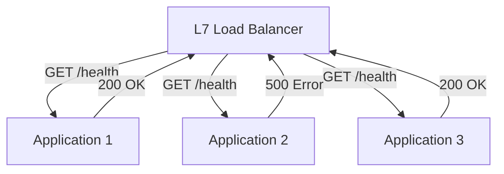

The Load Balancer can determine:

```text
Application 1 = Healthy
Application 2 = Unhealthy
Application 3 = Healthy
```

and stop routing new traffic to Application 2.

This is often more meaningful than checking only whether a TCP port is open.

---

# 20. L7 Advantages and Disadvantages

## Advantages

- Application-aware routing
- Path-based routing
- Host-based routing
- Header-based routing
- Cookie-based routing
- TLS termination
- HTTP redirects
- Request filtering
- Rate limiting
- Canary routing
- API version routing

## Disadvantages

- More processing than L4
- More configuration
- More complexity
- Requires understanding of application protocols
- Can introduce additional latency if poorly designed

---

# 21. L4 vs L7

This is the most important comparison.

| Feature               | L4               | L7                        |
| --------------------- | ---------------- | ------------------------- |
| OSI Layer             | Transport        | Application               |
| TCP                   | Yes              | Yes                       |
| UDP                   | Yes              | Depends on implementation |
| IP aware              | Yes              | Yes                       |
| Port aware            | Yes              | Yes                       |
| HTTP aware            | No               | Yes                       |
| URL routing           | No               | Yes                       |
| Host routing          | No               | Yes                       |
| Header routing        | No               | Yes                       |
| Cookie routing        | No               | Yes                       |
| TLS termination       | Usually not      | Common                    |
| Application awareness | Low              | High                      |
| Processing overhead   | Lower            | Higher                    |
| Routing decisions     | Connection-based | Request-based             |
| Performance           | Very high        | High                      |
| Complexity            | Lower            | Higher                    |

## Easy Way to Remember

```text
L4:

"Which connection should go to which server?"

L7:

"Which request should go to which service?"
```

Another way:

```text
L4
 |
 +-- IP
 +-- Port
 +-- TCP
 +-- UDP
 +-- Connection
```

```text
L7
 |
 +-- HTTP
 +-- HTTPS
 +-- URL
 +-- Host
 +-- Headers
 +-- Cookies
 +-- Application request
```

---

# 22. Load Balancing Algorithms

## Round Robin

```text
Request 1 -> Server 1
Request 2 -> Server 2
Request 3 -> Server 3
Request 4 -> Server 1
```

Best when:

- Servers are similar
- Requests have similar cost

---

## Weighted Round Robin

```text
Server 1 = Weight 5
Server 2 = Weight 3
Server 3 = Weight 1
```

Best when:

- Servers have different capacities

---

## Least Connections

```text
Server 1 = 100 connections
Server 2 = 20 connections
Server 3 = 50 connections
```

Next connection:

```text
             |
             v
         Server 2
```

Useful when connection duration varies.

---

## IP Hash

```text
Client IP
    |
    v
Hash
    |
    v
Backend selection
```

Can provide a degree of session persistence.

---

## Consistent Hashing

Consistent hashing is useful when maintaining relatively stable mappings is important, especially as backend membership changes.

It is commonly associated with:

- Distributed caches
- Stateful routing
- Large distributed systems

---

# 23. Failover

One of the most important features of Load Balancing is automatic failover.

Normal situation:

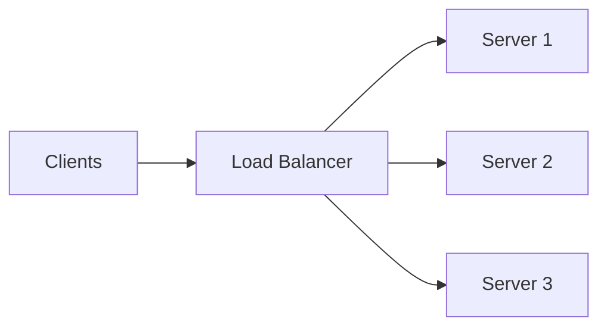

Suppose Server2 crashes:

```text
                    Load Balancer
                         |
             +-----------+-----------+
             |           |           |
             v           v           v
          Server1     Server2     Server3
             ✓           X           ✓
                         |
                      DOWN
```

The Load Balancer detects the failure.

Then:

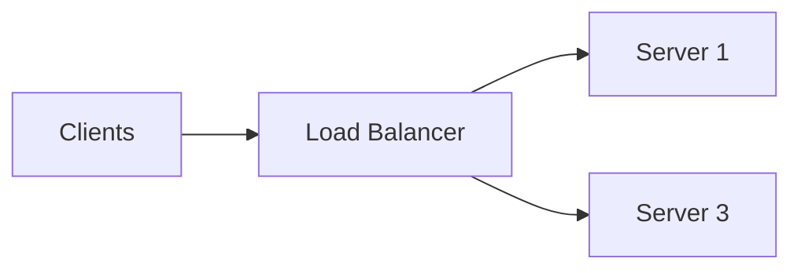

Server2 is removed from the active backend pool.

When Server2 recovers:

```text
Server2
   |
   v
Health check
   |
   v
Healthy
   |
   v
Added back to pool
```

---

# 24. Connection Draining

Suppose a server needs maintenance.

We don't want to immediately terminate active requests.

Instead:

```text
              Load Balancer
                   |
            Stop NEW requests
                   |
                   v
              Server #2
                   |
          Existing requests
             finish normally
                   |
                   v
             Server removed
```

This is called **connection draining** or **graceful removal**.

Without connection draining:

```text
Active request
      |
      v
Server killed
      |
      v
Request fails
```

Connection draining is particularly useful during:

- Deployments
- Scaling down
- Server maintenance
- Instance replacement

---

# 25. Session Persistence

Normally, a Load Balancer can send requests from the same client to different servers.

```text
Request 1 ---> Server 1
Request 2 ---> Server 2
Request 3 ---> Server 3
```

For some applications, this can cause problems if session state exists only in memory on one server.

Example:

```text
Login
  |
  v
Server 1
  |
  v
Session stored in Server 1 memory
```

Next request:

```text
Client
  |
  v
Load Balancer
  |
  v
Server 2
  |
  X
Session not found
```

One solution is sticky sessions.

Another solution is to store session state centrally:

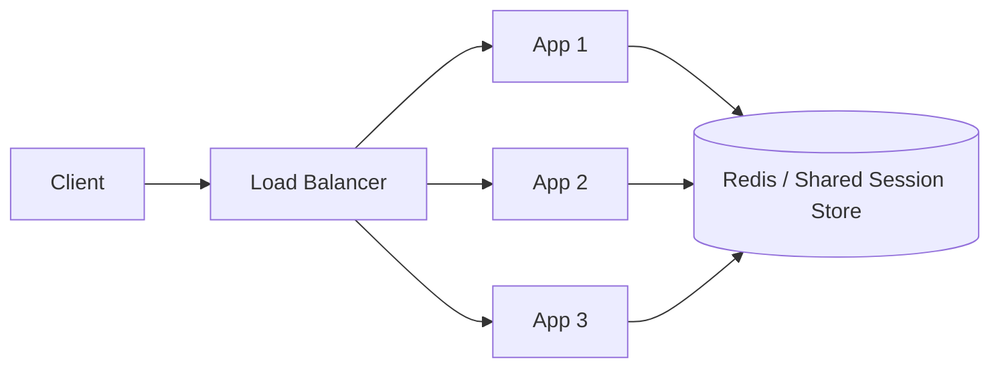

This allows any application instance to retrieve the session.

---

# 26. Reverse Proxy vs Load Balancer

A reverse proxy sits in front of backend servers.

```text
Client
   |
   v
Reverse Proxy
   |
   +----> Server 1
   |
   +----> Server 2
   |
   +----> Server 3
```

A reverse proxy can provide:

- Request forwarding
- TLS termination
- Caching
- Compression
- Routing
- Authentication integration
- Security controls

A Load Balancer can also perform many of these functions.

Therefore, the concepts overlap.

For example, software such as NGINX can act as both:

```text
Reverse Proxy
       +
Load Balancer
```

---

# 27. Forward Proxy vs Reverse Proxy

This is a common interview question.

## Forward Proxy

A forward proxy represents clients.

```text
Client
   |
   v
Forward Proxy
   |
   v
Internet
```

The destination server may see the proxy as the source of the request.

---

## Reverse Proxy

A reverse proxy represents servers.

```text
Internet
   |
   v
Reverse Proxy
   |
   +----> Server 1
   +----> Server 2
   +----> Server 3
```

The client doesn't necessarily know which backend server handles the request.

### Easy Way to Remember

```text
Forward Proxy:

"I represent the CLIENT."


Reverse Proxy:

"I represent the SERVER."
```

---

# 28. L4 + L7 Architecture

In large systems, L4 and L7 can be used together.

Example:

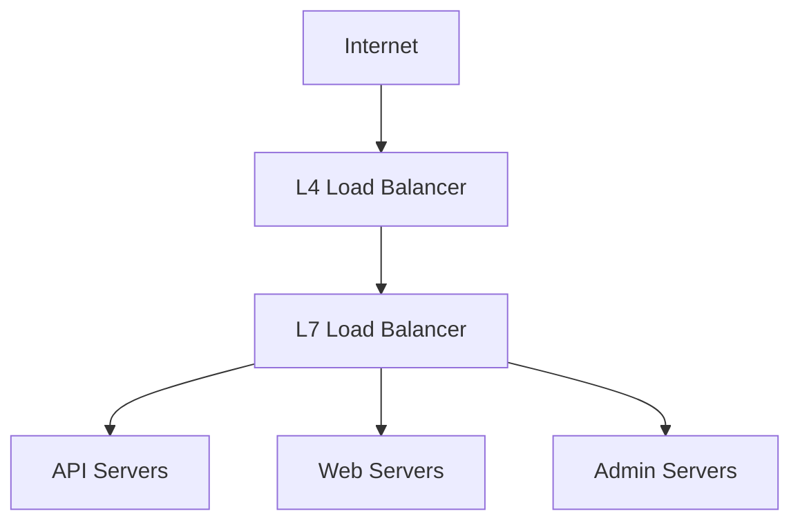

The L4 layer can handle connection-level distribution.

The L7 layer can then perform application-aware routing.

For example:

```text
Client
   |
   | TCP :443
   v
L4 Load Balancer
   |
   v
L7 Load Balancer
   |
   +---- /api/* ----> API
   |
   +---- /web/* ----> Web
   |
   +---- /admin/* --> Admin
```

Whether both layers are needed depends on the architecture.

---

# 29. Production Architecture

A more complete production architecture might look like:

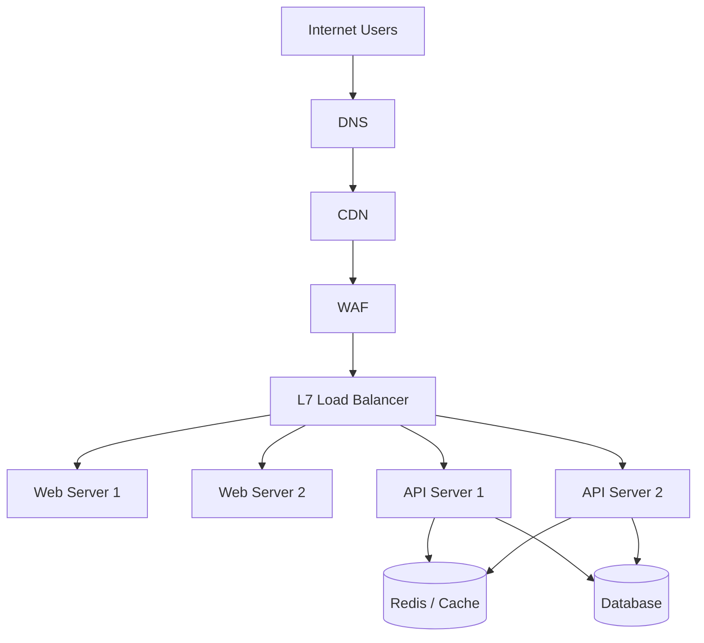

A typical request might flow like:

```text
User
 |
 v
DNS
 |
 v
CDN
 |
 v
WAF
 |
 v
Load Balancer
 |
 v
Application
 |
 +----> Cache
 |
 +----> Database
```

Each component has a different responsibility.

---

# 30. Kubernetes Load Balancing

Kubernetes introduces several concepts that are related to Load Balancing.

A simplified architecture:

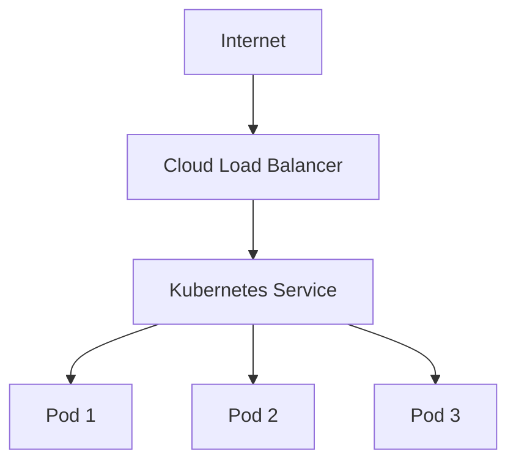

Important Kubernetes concepts include:

- ClusterIP
- NodePort
- LoadBalancer
- Ingress
- Gateway API
- Service

A `Service` provides a stable networking abstraction in front of Pods.

A cloud `LoadBalancer` Service can expose an application externally.

An Ingress or Gateway can provide more application-aware HTTP routing, depending on the controller/gateway implementation.

---

# 31. NGINX L7 Example

NGINX can operate as a reverse proxy and HTTP Load Balancer.

Example:

```nginx
upstream backend {
    server 10.0.1.10:8080;
    server 10.0.1.11:8080;
    server 10.0.1.12:8080;
}

server {
    listen 80;

    location / {
        proxy_pass http://backend;
    }
}
```

The architecture is:

```text
Client
  |
  | HTTP
  v
NGINX
  |
  +----> 10.0.1.10:8080
  |
  +----> 10.0.1.11:8080
  |
  +----> 10.0.1.12:8080
```

---

## Path-Based NGINX Routing

For example:

```nginx
upstream api_backend {
    server 10.0.1.10:8080;
    server 10.0.1.11:8080;
}

upstream web_backend {
    server 10.0.2.10:8080;
    server 10.0.2.11:8080;
}

server {
    listen 80;

    location /api/ {
        proxy_pass http://api_backend;
    }

    location / {
        proxy_pass http://web_backend;
    }
}
```

Now:

```text
/api/users
    |
    v
API backend
```

while:

```text
/home
    |
    v
Web backend
```

---

# 32. L4 TCP Example

A TCP Load Balancer can forward raw TCP connections.

Conceptually:

```text
Client
   |
   | TCP :5432
   v
+----------------+
|   L4 Load      |
|    Balancer    |
+----------------+
      /    \
     /      \
    v        v
 DB-1      DB-2
 :5432     :5432
```

The L4 layer doesn't need to understand an HTTP request.

It is forwarding a TCP connection.

This is useful for TCP-based services.

However, for databases and other stateful systems, simply distributing connections does not automatically make the architecture safe or correct. Replication, read/write behavior, transactions, connection pooling, and failover strategy must be considered.

---

# 33. Common Failure Scenarios

## Scenario 1: Backend Server Down

```text
LB
 |
 +----> Server 1 ✓
 |
 +----> Server 2 ✗
 |
 +----> Server 3 ✓
```

The Load Balancer should stop sending new traffic to Server2.

---

## Scenario 2: No Healthy Backend

```text
                Load Balancer
                      |
          +-----------+-----------+
          |           |           |
          X           X           X
        App1        App2        App3
       DOWN         DOWN        DOWN
```

There is nowhere to send traffic.

Users may receive an error such as:

```text
503 Service Unavailable
```

---

## Scenario 3: Backend Timeout

```text
Client
  |
  v
Load Balancer
  |
  v
Application
  |
  | No response
  |
  X
Timeout
```

The client may eventually receive:

```text
504 Gateway Timeout
```

---

## Scenario 4: Bad Health Check

Suppose:

```text
TCP port = OPEN
Application = BROKEN
```

A simple TCP health check might say:

```text
✓ Healthy
```

even though the application cannot actually serve requests.

An application-aware check such as:

```http
GET /health
```

may provide a better signal.

---

# 34. Monitoring

A production Load Balancer should be monitored.

Important metrics include:

### Traffic

- Requests per second
- Bytes received
- Bytes sent
- Bandwidth

### Connections

- Active connections
- New connections
- Connection errors
- Connection duration

### HTTP

- HTTP 2xx
- HTTP 3xx
- HTTP 4xx
- HTTP 5xx

### Backend Health

- Healthy backends
- Unhealthy backends
- Health check failures

### Latency

- Average latency
- p95 latency
- p99 latency
- Backend response time

Example:

```text
Requests/sec
      |
      v
   20,000
      |
      v
+-------------+
| Load Balancer|
+-------------+
      |
      +----> Backend health
      |
      +----> Error rate
      |
      +----> Latency
      |
      +----> Connections
```

---

# 35. Security

A Load Balancer is often an important security boundary.

Common security controls include:

- TLS
- Certificate management
- WAF
- Rate limiting
- IP allowlists
- IP blocklists
- Security groups
- Firewalls
- Private backend networks
- Header validation
- DDoS protection
- Access logging

A common architecture:

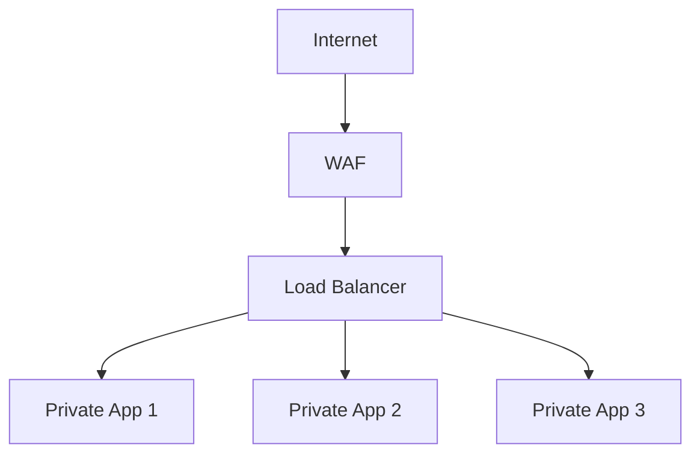

Ideally, backend servers are not unnecessarily exposed directly to the public Internet.

---

# 36. Troubleshooting

When an application behind a Load Balancer is failing, troubleshoot layer by layer.

```text
                    Client
                       |
                       v
                  DNS working?
                       |
                       v
                Load Balancer reachable?
                       |
                       v
                 TLS working?
                       |
                       v
                Health checks passing?
                       |
                       v
                  Backend reachable?
                       |
                       v
                Application responding?
                       |
                       v
                  Check logs/metrics
```

---

## Common HTTP Errors

| Status | Common Meaning                                   |
| ------ | ------------------------------------------------ |
| 400    | Bad request                                      |
| 401    | Authentication required                          |
| 403    | Forbidden                                        |
| 404    | Resource not found                               |
| 502    | Bad gateway / invalid backend response           |
| 503    | No available healthy backend/service unavailable |
| 504    | Gateway timeout                                  |

These are general meanings; the exact cause depends on the Load Balancer and application.

---

## Troubleshooting Questions

### 1. Is DNS working?

```bash
nslookup example.com
```

or:

```bash
dig example.com
```

---

### 2. Is the Load Balancer reachable?

```bash
curl -v https://example.com
```

---

### 3. Is the backend reachable?

From an appropriate network location:

```bash
curl -v http://10.0.1.10:8080
```

---

### 4. Is the application listening?

```bash
ss -lntp
```

---

### 5. Is the health check passing?

Check:

```text
Health Check
     |
     +---- Status
     +---- Response code
     +---- Response time
     +---- Failure reason
```

---

### 6. Check Load Balancer logs

Look for:

- Client IP
- Request path
- Backend selected
- Response status
- Backend latency
- Connection errors
- TLS errors

---

# 37. Common Misconceptions

## "L7 is always better than L4."

Not true.

They solve different problems.

```text
L4 = connection-level routing

L7 = application-level routing
```

Use the layer appropriate for the workload.

---

## "A Load Balancer automatically makes my application highly available."

Not necessarily.

If the architecture is:

```text
              Load Balancer
                    |
                    v
                Server 1
```

there is still only one backend.

A better design is:

```text
              Load Balancer
                /       \
               v         v
           Server 1   Server 2
```

And the Load Balancer itself may also need redundancy.

---

## "If the server responds to ping, it is healthy."

Not necessarily.

A server can respond to ICMP while:

```text
Application = DOWN
```

Application-level health checks are often more useful.

---

## "More servers always means better performance."

Not necessarily.

Other bottlenecks may exist:

```text
Load Balancer
      |
      v
Application
      |
      v
Database
      |
      X
Database bottleneck
```

Adding application servers won't necessarily fix a database bottleneck.

---

## "Sticky sessions are always bad."

Not necessarily.

They can be useful for applications that require session affinity.

However, they can complicate:

- Scaling
- Failover
- Load distribution

Stateless application design often reduces the need for them.

---

# 38. Interview Questions

## Beginner

### 1. What is a Load Balancer?

A system that distributes incoming traffic across multiple backend servers.

### 2. Why do we need a Load Balancer?

For:

- Availability
- Scalability
- Failover
- Performance
- Traffic distribution

### 3. What is L4?

Layer 4 Load Balancing operates at the Transport Layer and primarily works with TCP/UDP connection information.

### 4. What is L7?

Layer 7 Load Balancing operates at the Application Layer and can understand application protocols such as HTTP/HTTPS.

---

## Intermediate

### 5. What is the difference between L4 and L7?

```text
L4:
IP + Port + TCP/UDP + Connection

L7:
HTTP + URL + Host + Headers + Cookies + Request
```

### 6. What is health checking?

A mechanism used by a Load Balancer to determine whether a backend should receive traffic.

### 7. What is connection draining?

Gracefully removing a backend while allowing existing connections to finish.

### 8. What is sticky session?

A mechanism that attempts to keep a client's requests associated with the same backend.

### 9. What is TLS termination?

The Load Balancer accepts the client's TLS connection and decrypts the traffic there.

### 10. What is reverse proxy?

A server that sits in front of backend servers and forwards client requests to them.

---

## Advanced

### 11. Can L4 Load Balancing handle HTTP?

Yes.

HTTP normally runs over TCP, so an L4 Load Balancer can forward the TCP connection without understanding the HTTP request itself.

### 12. Can L7 route based on URL?

Yes.

For example:

```text
/api/*     -> API
/web/*     -> Web
/images/*  -> Image service
```

### 13. Why might an application return 503?

A common reason is that the Load Balancer has no healthy backend available.

### 14. Why might an application return 504?

A common reason is that the upstream/backend did not respond within the configured timeout.

### 15. How would you design a highly available Load Balancer?

Consider:

```text
                Internet
                   |
             +-----+-----+
             |           |
             v           v
           LB-1        LB-2
             |           |
             +-----+-----+
                   |
            +------+------+
            |             |
            v             v
          App 1         App 2
```

You also need to consider:

- Health checks
- DNS
- Failover
- Backend redundancy
- Database availability
- Monitoring
- Security
- Capacity

---

# 39. Quick Cheat Sheet

## Layer 4

```text
+--------------------------------+
|          L4 Load Balancer      |
+--------------------------------+
|                                |
|  TCP                           |
|  UDP                           |
|  IP                            |
|  Port                          |
|  Connection                    |
|                                |
+--------------------------------+
```

Think:

> **"Which connection should go to which server?"**

---

## Layer 7

```text
+--------------------------------+
|          L7 Load Balancer      |
+--------------------------------+
|                                |
|  HTTP                          |
|  HTTPS                         |
|  URL                           |
|  Host                          |
|  Headers                       |
|  Cookies                       |
|  Request                       |
|                                |
+--------------------------------+
```

Think:

> **"Which request should go to which service?"**

---

# Final Mental Model

The easiest way to understand Load Balancing is:

```text
                         LOAD BALANCING
                               |
                +--------------+--------------+
                |                             |
                v                             v
               L4                            L7
                |                             |
        "Connection aware"             "Request aware"
                |                             |
          TCP / UDP                    HTTP / HTTPS
                |                             |
           IP + Port                    URL / Host
                |                             |
                |                       Headers
                |                       Cookies
                |                             |
                v                             v
        Choose a backend              Choose a service
```

## One-Line Summary

```text
L4 = Load balance connections.

L7 = Load balance application requests.
```

## Practical Example

```text
                         USER
                           |
                           v
                    +-------------+
                    |     DNS     |
                    +-------------+
                           |
                           v
                    +-------------+
                    |     L4      |
                    | Load Balancer|
                    +-------------+
                           |
                           v
                    +-------------+
                    |     L7      |
                    | Load Balancer|
                    +-------------+
                           |
              +------------+------------+
              |            |            |
              v            v            v
           /api/*       /web/*      /admin/*
              |            |            |
              v            v            v
          API Servers   Web Servers  Admin Servers
              |            |            |
              +------------+------------+
                           |
                           v
                       Database
```

The key idea is that **L4 decides using connection-level information**, while **L7 can make intelligent decisions based on the actual application request**.

---

# Summary

A Load Balancer provides a layer between clients and backend systems.

The two most important models are:

```text
L4
 |
 +-- Transport Layer
 +-- TCP / UDP
 +-- IP / Port
 +-- Connection-level decisions
 +-- Very high performance
```

and:

```text
L7
 |
 +-- Application Layer
 +-- HTTP / HTTPS
 +-- URL / Host / Headers / Cookies
 +-- Request-level decisions
 +-- Intelligent routing
```

Neither is universally better.

The correct choice depends on:

- Protocol
- Performance requirements
- Routing requirements
- Application architecture
- Security requirements
- Session management
- Operational complexity
- Availability requirements

> **If you only need to distribute network connections, L4 may be enough.**

> **If you need to understand and route application requests, L7 is usually the appropriate choice.**
