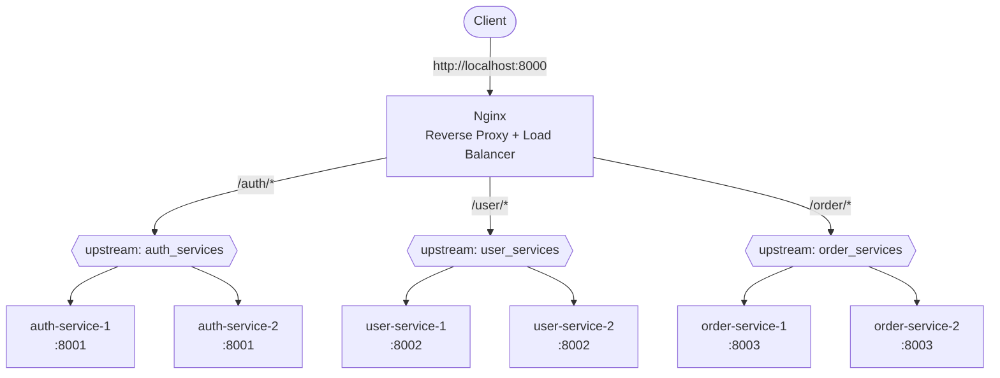

# Multi-Service Reverse Proxy + Load Balancer (Nginx + Docker Compose)

A practice setup demonstrating how a single Nginx instance can act as **both a reverse proxy and a load balancer** for multiple backend microservices (`auth`, `user`, `order`), each running with 2 replicas.

## Architecture



## How it works

| Layer             | Responsibility                                                  | Nginx construct   |
| ----------------- | --------------------------------------------------------------- | ----------------- |
| **Reverse Proxy** | Decides _which service_ a request belongs to, based on URL path | `location` blocks |
| **Load Balancer** | Decides _which instance_ of that service handles the request    | `upstream` blocks |

Both responsibilities live in the same Nginx process/config — there's no need for separate proxy and LB layers unless you're deliberately practicing that extra hop.

- `location /auth/` → routes to the `auth_services` upstream pool → round-robins between `auth-service-1` and `auth-service-2`
- `location /user/` → routes to the `user_services` upstream pool → round-robins between `user-service-1` and `user-service-2`
- `location /order/` → routes to the `order_services` upstream pool → round-robins between `order-service-1` and `order-service-2`

## Health checks & failover

Each `upstream` server is configured with:

```
max_fails=3 fail_timeout=30s
```

This is a **passive health check**: if a backend fails 3 times within 30 seconds, Nginx marks it "down" and stops routing traffic to it for 30 seconds, then retries.

Each backend container also has its own Docker-level healthcheck (`curl -f http://localhost:<port>/health`), which Compose uses via `depends_on: condition: service_healthy` to make sure Nginx only starts after all backends report healthy.

## Nginx config

```nginx
upstream auth_services {
    server auth-service-1:8001 max_fails=3 fail_timeout=30s;
    server auth-service-2:8001 max_fails=3 fail_timeout=30s;
}

upstream user_services {
    server user-service-1:8002 max_fails=3 fail_timeout=30s;
    server user-service-2:8002 max_fails=3 fail_timeout=30s;
}

upstream order_services {
    server order-service-1:8003 max_fails=3 fail_timeout=30s;
    server order-service-2:8003 max_fails=3 fail_timeout=30s;
}

server {
    listen 8000;
    server_name localhost;

    proxy_set_header Host $host;
    proxy_set_header X-Real-IP $remote_addr;
    proxy_set_header X-Forwarded-For $proxy_add_x_forwarded_for;
    proxy_set_header X-Forwarded-Proto $scheme;
    proxy_connect_timeout 5s;
    proxy_read_timeout 10s;

    location /auth/ {
        proxy_pass http://auth_services/;
    }

    location /user/ {
        proxy_pass http://user_services/;
    }

    location /order/ {
        proxy_pass http://order_services/;
    }
}
```

> **Note:** the trailing `/` after each upstream name in `proxy_pass` strips the `location` prefix before forwarding — e.g. `GET /auth/login` is forwarded to the backend as `GET /login`. Remove the trailing slash if your backend routes already include the prefix (e.g. `/auth/login`).

## Running it

```bash
docker compose up --build
```

## Verifying load balancing

Hit an endpoint multiple times and check which replica responds (assuming each service returns its `SERVER_SERVICE_NAME` env var somewhere in its `/health` or root response):

```bash
for i in {1..6}; do curl -s http://localhost:8000/auth/health; echo; done
```

You should see responses alternate between `auth-service-1` and `auth-service-2`.

## Port map (host-facing, for direct debugging only)

| Service       | Container         | Host Port | Internal Port |
| ------------- | ----------------- | --------- | ------------- |
| Reverse Proxy | `reverse-proxy`   | 8000      | 8000          |
| Auth          | `auth-service-1`  | 8001      | 8001          |
| Auth          | `auth-service-2`  | 8011      | 8001          |
| User          | `user-service-1`  | 8002      | 8002          |
| User          | `user-service-2`  | 8012      | 8002          |
| Order         | `order-service-1` | 8003      | 8003          |
| Order         | `order-service-2` | 8013      | 8003          |

In production you'd typically remove these host port mappings so services are only reachable through the reverse proxy.

## Next steps to extend this practice

- Add active health checks (Nginx Plus, or swap in something like Traefik/HAProxy for OSS active checks)
- Add `limit_req_zone` for per-service rate limiting
- Add `proxy_next_upstream` to control retry behavior on backend failure
- Swap round-robin (default) for `least_conn` or `ip_hash` and observe the difference under load
